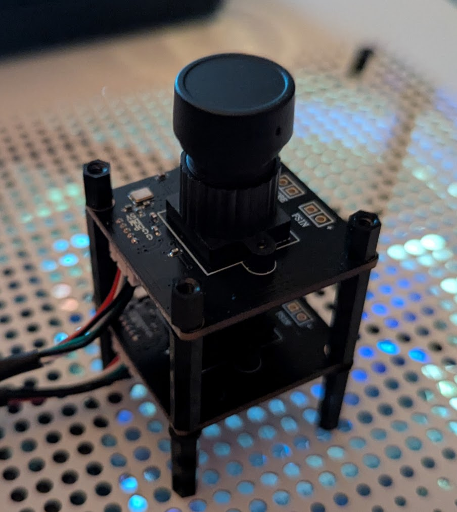
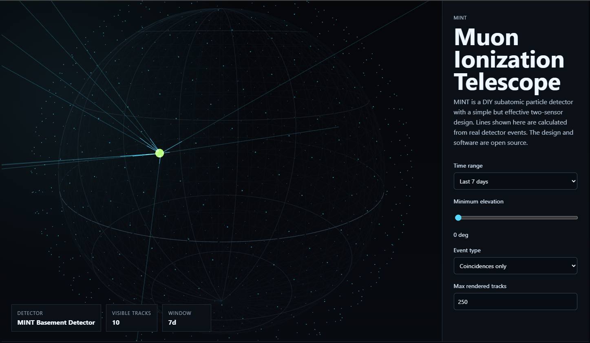
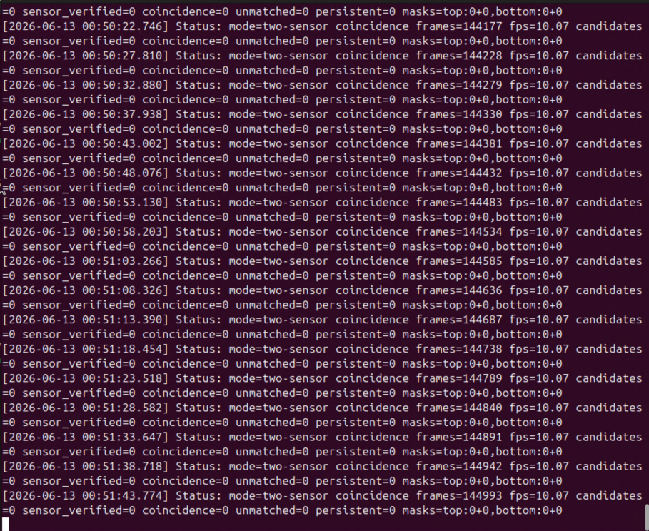

# MINT

**MINT (Muon Ionization Telescope) DIY Subatomic Particle Detector Software & Build**

MINT is subatomic particle-detector software and a build design for inexpensive camera sensors. It starts as a dark-frame detector for a single webcam, but also allows for a more sophisticated two-sensor coincidence detector that can separate one-camera noise from events that pass through two independent layers of silicon.

For about $70, you can build your own 2-sensor detector.



More precisely, MINT is a **candidate particle event detector**. A single dark camera can detect transient sensor events, but cannot prove what caused them. A two-sensor coincidence build is much closer to a real particle detector because a penetrating particle can trigger both sensors while local camera noise should remain isolated to one sensor.



See a detector in action at [https://mint.jaglab.org](https://mint.jaglab.org).

## What MINT Detects and Why It's Exciting

Muons are secondary particles created by nature's particle collider: high-energy cosmic rays colliding with protons and neutrons in the upper atmosphere, breaking them into subatomic particles. Muons carry an electric charge identical to an electron or positron but with 200 times the mass. As these heavy, charged particles pass through a silicon sensor at 99.9% the speed of light, their powerful electromagnetic field frees electrons from silicon atoms along the path, generating a hit on the camera.

A small home particle detector can log a local record of candidate muon hit patterns, directions, and rates correlated with atmospheric and cosmic events. While we know many cosmic rays originate from solar flares and supernovae, the ultimate sources of the most energetic particles remain a mystery. Engaging in low-cost, distributed data collection helps bridge the gap in our understanding of these deep-space accelerators.

MINT is a tiny way to touch that mystery from a desk, server shelf, garage, or spare laptop. It lets you build a listening post and can help contribute to our collective understanding of these high-energy events.



## Who This is For

If you have an interest in home-based science, physics, and astronomy, then this is great for you.

It helps to have a basic understanding of:
* Python and command line interfaces
* Astrophotography terms and calibration
* CMOS sensors
* Working with raw data

The hardest part of this setup is calibrating your sensors and identifying the right thresholds. It may take hundreds of runs to set the right parameters. Each sensor is unique.

But fortunately, you can use Claude Code or Codex to help you with all aspects of this project. I even have an OpenClaw Agent acting as my lab partner to help with the tests and log parsing.

## What MINT Is Actually Detecting

A cosmic ray is usually a high-energy particle arriving from space, often a proton or atomic nucleus. MINT is probably not detecting that original primary cosmic ray directly. Instead, it is looking for evidence of **secondary muons** created after the primary cosmic ray hits Earth's upper atmosphere.

```text
Primary cosmic ray from space
        |
        v
Hits upper atmosphere
        |
        v
Particle shower
        |
        v
Muons, electrons, photons, neutrinos, etc.
        |
        v
Some muons reach your detector
        |
        v
Muon passes through two camera sensors
```

Muons are useful because they are heavy cousins of electrons: they have the same negative electric charge, but about 207 times more mass. They are unstable, with a mean lifetime of about 2.2 microseconds at rest, but many are moving close enough to the speed of light that special relativity lets them survive the trip from the upper atmosphere to the ground.

For a small detector, muons have a few practical advantages:

* **Penetrating:** they can pass through roofs, walls, bodies, and basement ceilings.
* **Common enough:** a rough sea-level order of magnitude is about one muon per square centimeter per minute, depending on angle, altitude, shielding, and detector threshold.
* **Directional:** more arrive from near overhead than from near the horizon.
* **Useful probes:** muons are used in real muon tomography work, including imaging volcanoes, pyramids, reactors, and dense structures.

With a calibrated two-sensor MINT build, you can estimate the **local incoming direction** of a muon-like candidate: for example, azimuth 240 degrees, elevation 65 degrees. That is not the same as identifying the astrophysical source of the original cosmic ray. Primary cosmic rays are often charged, magnetic fields bend their paths, the atmosphere creates secondary particles, and a two-camera basement detector samples only a tiny slice of the resulting shower.

To infer cosmic origin direction, you would need something closer to a larger detector area, multiple separated detector stations, precise timing, full air-shower reconstruction, atmospheric and geomagnetic modeling, and lots of events over long periods. That is the territory of observatory-scale projects.

There is still useful science-adjacent work in local muon direction and timing:

* Zenith-angle distribution: muons should be more common from near overhead than near the horizon.
* Rate over time: event rate can vary with atmospheric pressure, altitude, shielding, and detector stability.
* Barometric effect: higher air pressure usually means slightly fewer ground-level muons because the atmosphere is effectively thicker.
* Building and shielding effects: basement walls, soil, concrete, or nearby structures may suppress some directions.
* Coincidence purity: two-sensor coincidence rates can be compared against single-sensor transient rates.
* Detector stability: dark current, hot pixels, thermal drift, false positives, and threshold behavior can be measured over time.

The big unlock is publishing calibrated open data: timestamp, location, detector orientation, geometry, environmental metadata, calibration summaries, event crops, and direction histograms. MINT is not a source-discovery instrument, but it can become a reproducible local muon monitor.

## What It Does

MINT:

* Captures frames from one or two OpenCV-compatible cameras.
* Converts frames to 8-bit grayscale dark frames.
* Runs startup calibration for each sensor to estimate baseline noise and static hot pixels.
* Masks static hot pixels and runtime persistent pixels.
* Detects high-intensity pixel clusters above a configurable threshold.
* Verifies candidates by checking that the same cluster disappears in the next frame.
* Logs verified candidate events to append-safe JSON Lines.
* Saves small grayscale crop images around each event.
* Writes periodic status snapshots for troubleshooting.
* Monitors dark-frame noise drift and can shut down on sustained overheat/light-leak risk.
* Supports simulation mode so the whole pipeline can be tested without waiting for rare events.
* Scores each single-sensor event with a heuristic quality score, artifact risk score, and confidence class.
* In two-sensor mode, promotes paired hits to `coincidence_candidate` events.
* Optionally reconstructs local arrival direction when a detector calibration file is available.

## Detector Modes

### Single-Sensor Mode

Single-sensor mode is the default. It is great for experimentation, calibration, and learning the noise behavior of your camera.

```powershell
python -m orbit_ray.cli
```

A single dark-covered webcam can identify candidate transient sensor events. It cannot, by itself, confirm that an event was a cosmic ray. Single-camera detections may be real particle interactions, thermal noise, hot pixels, electronics artifacts, or environmental radiation.

### Two-Sensor Coincidence Mode

Two-sensor mode opens two cameras, calibrates them independently, runs the same transient detector on both streams, and then looks for events that appear on both sensors within a configurable frame and centroid-distance window.

This technique is a small version of a **coincidence telescope**. Random thermal noise on one sensor should not happen at nearly the same time and place on a second independent sensor. A penetrating muon, however, can pass through both sensor layers.

The current implementation assumes the two sensors are reasonably aligned by the physical build: identical camera boards stacked vertically using the boards' pre-drilled mounting holes and rigid standoffs. A future alignment workflow could map offsets between sensors and compensate for rotation, translation, or scale differences.

Enable it in config:

```json
{
  "coincidence": {
    "enabled": true,
    "max_frame_delta": 1,
    "max_centroid_distance_pixels": 12.0,
    "log_unmatched_sensor_events": true
  },
  "camera": {
    "index": 0,
    "label": "top"
  },
  "secondary_camera": {
    "index": 1,
    "label": "bottom"
  }
}
```

Then run:

```powershell
python -m orbit_ray.cli --config config.example.json
```

In two-sensor mode, JSONL records may include:

* `coincidence_candidate`: paired transient detected on both sensors.
* `unmatched_sensor_candidate`: transient detected on only one sensor. These are still useful for troubleshooting sensor noise, threshold settings, heat drift, and light leaks.

## How It Works

The single-sensor pipeline:

```text
[Camera Stream]
        |
        v
[Grayscale Dark Frame]
        |
        v
[Calibration: Noise Stats + Static Hot-Pixel Mask]
        |
        v
[Runtime Masking: Static + Dynamic Masks]
        |
        v
[Threshold Filtering]
        |
        v
[Cluster Extraction]
        |
        v
[Transient Verification: Frame t+1]
        |
        v
[JSONL Event Log + Crop Images + Status Snapshots]
```

The two-sensor pipeline runs that detector independently for each camera, then adds:

```text
[Verified Top Sensor Transients]      [Verified Bottom Sensor Transients]
                 |                         |
                 v                         v
             [Frame + Centroid Coincidence Matcher]
                             |
                             v
                  [Coincidence Event Log Record]
```

During calibration, MINT captures a stack of dark frames and marks pixels that are repeatedly bright as static hot pixels. During capture, it looks for pixels above the trigger threshold, groups contiguous pixels into clusters, and holds each candidate for one frame. If the same coordinates are still bright in frame `t+1`, the candidate is treated as persistent noise and added to the runtime mask. If the signal disappears, it becomes a verified transient. In two-sensor mode, verified transients from both sensors are compared for coincidence.

## Hardware Recommendation

For a first dedicated two-sensor build, use two identical USB camera modules. The **InnoMaker U20CAM-9281M / OV9281 Global Shutter Mono USB Camera Module** is a strong starting point. InnoMaker lists it as a 1MP monochrome global-shutter OV9281 UVC module with Windows, Linux, and macOS plug-and-play support, YUY2/MJPG output, and 1280x800/1280x720 modes. It is also small enough to stack mechanically.

At the time of writing, the manufacturer page listed the U20CAM-9281M at about **$33 per module**, and Amazon pricing commonly floats around the low-to-mid `$30s`. Plan on buying two matched modules.

Why this sensor family is attractive:

* **Monochrome:** no Bayer color interpolation, so bright pixels are cleaner luminance events.
* **Global shutter:** the full sensor exposes at once, which makes timing between stacked cameras more meaningful.
* **UVC USB:** should appear as ordinary video devices on Windows and Linux.
* **Small board:** easier to stack with nylon standoffs.
* **Low power:** practical for 24/7 logging if you manage heat.

Product reference: [InnoMaker U20CAM-9281M](https://www.inno-maker.com/product/u20cam-9281m/)

## Two-Sensor Physical Build

Stack the sensors vertically, not side-by-side. You want one high-energy particle to pass through both silicon layers in sequence.

```text
        Incoming muon path
               |
               v
   +-------------------------+
   | Top lightproof cap      |
   | Top OV9281 sensor board |
   +-------------------------+
        10-15 mm spacer
   +-------------------------+
   | Bottom OV9281 board     |
   | Bottom lightproof layer |
   +-------------------------+
```

Build notes:

* Use non-conductive M3 nylon screws, nuts, and 10-15 mm standoffs.
* Align the sensors on the X/Y axes as closely as possible.
* For the first software pass, assume the boards are aligned well enough by the shared mounting-hole geometry.
* Keep the boards parallel and rigid so vibration does not ruin alignment.
* Route USB cables so they do not pull on the frame.
* Prefer a small lightproof project box over wrapping whole boards in tape.
* Block light at the lens/sensor path, but leave room for heat to escape.
* Lens removal may improve the physical stack, but validate the camera module mechanically before committing to that path.

Spacing matters. A very wide separation creates a narrower acceptance angle and may reduce the hit rate dramatically. A tight 10-15 mm separation is a better first build because it gives the code a fighting chance to see coincidences while you are still experimenting.

## Thermal Notes

Heat creates dark current: thermally generated electrons inside the sensor that can look like faint signal. Over long runs, rising temperature can increase noise and hot-pixel behavior.

Practical mitigations:

* Do not wrap the entire board in insulating tape.
* Use a tiny adhesive copper or aluminum heatsink on the back of each camera board if it fits safely.
* Keep airflow around the boards when possible.
* Watch dynamic mask growth and calibration stats.

MINT includes a conservative safety monitor. It does not read a physical temperature sensor; most UVC cameras do not expose one. Instead, it watches for sustained dark-frame noise drift, excessive bright pixels, and runaway dynamic-mask growth. If `safety.shutdown_on_unsafe` is enabled and the condition lasts for `safety.consecutive_unsafe_frames`, MINT exits with:

```text
Overheat potential detected, shutting down.
```

This should be treated as "possible overheating, light leak, or camera setting drift" rather than a precise thermometer. Future work should add rolling dark-baseline adjustment for 24/7 deployments.

## Detector Calibration And Track Reconstruction

Track reconstruction requires more than two matching bright pixels. MINT needs a calibration model that describes the detector's location, orientation, physical geometry, and sensor-to-sensor alignment.

Create a calibration template:

```powershell
python -m orbit_ray.cli --write-calibration-template detector_calibration.json
```

Then edit the generated JSON:

```json
{
  "site": {
    "latitude_deg": 21.3069,
    "longitude_deg": -157.8583,
    "elevation_m": 10,
    "location_name": "example"
  },
  "pose": {
    "yaw_degrees_from_true_north": 0.0,
    "pitch_degrees": 0.0,
    "roll_degrees": 0.0,
    "top_sensor_label": "top",
    "bottom_sensor_label": "bottom"
  },
  "geometry": {
    "active_width_px": 1280,
    "active_height_px": 800,
    "pixel_pitch_um": 3.0,
    "sensor_separation_mm": 12.0
  },
  "bottom_to_top_alignment": {
    "x_offset_px": 0.0,
    "y_offset_px": 0.0,
    "rotation_degrees": 0.0,
    "scale_x": 1.0,
    "scale_y": 1.0
  }
}
```

Enable track reconstruction in config:

```json
{
  "track_reconstruction": {
    "enabled": true,
    "calibration_file": "detector_calibration.json"
  }
}
```

The first calibration workflow is intentionally manual:

1. Physically label the sensors as `top` and `bottom`.
2. Mount the detector so the sensor stack is vertical and rigid.
3. Point the top sensor's positive Y pixel axis toward true north as closely as practical.
4. Enter site latitude, longitude, and elevation.
5. Enter detector yaw, pitch, and roll. For the first pass, yaw is the key value.
6. Enter sensor pixel dimensions, pixel pitch, and measured sensor separation.
7. Start with zero offset/rotation between sensors if the boards are stacked using shared mounting holes.
8. Refine `bottom_to_top_alignment` later using a controlled dim-light or pinhole calibration routine.

Avoid a focused laser on a bare sensor. A dim diffused LED, masked aperture, or controlled corner illumination target is safer for a future alignment workflow. Once calibrated, coincidence records include a `track` object with local east/north/up unit vector, azimuth from true north, and elevation.

The current reconstruction code applies yaw and sensor geometry. Pitch and roll are part of the calibration model, but full tilt compensation is reserved for the next calibration pass. Your filled-in `detector_calibration.json` is ignored by Git because it may contain private location data; use [detector_calibration.example.json](detector_calibration.example.json) as the public template.

## Event Scoring

Each single-sensor event includes a heuristic score:

* `candidate_quality_score`: 0.0 to 1.0, where higher means cleaner candidate.
* `artifact_risk_score`: 0.0 to 1.0, where higher means more likely artifact.
* `confidence_class`: `low`, `medium`, or `high`.

The score currently considers signal strength, cluster shape, isolation from masked pixels, calibration stability, recent event rate, and dynamic mask activity.

Treat this as an artifact-rejection quality score, not a cosmic-ray probability. In two-sensor mode, `coincidence_candidate` records are the stronger evidence path.

## Setup

Install Python 3.10+ and dependencies:

```powershell
python -m venv .venv
.\.venv\Scripts\Activate.ps1
pip install -r requirements.txt
```

Optional YAML config support:

```powershell
pip install PyYAML
```

## Run

Single camera:

```powershell
python -m orbit_ray.cli
```

Simulated events:

```powershell
python -m orbit_ray.cli --simulate
```

Explicit config:

```powershell
python -m orbit_ray.cli --config config.example.json
```

Override the trigger threshold for a test run:

```powershell
python -m orbit_ray.cli --config config.example.json --threshold 20
```

If installed as a package, the CLI command is:

```powershell
mint --simulate
```

## Calibration And Threshold Tuning

Expect calibration and threshold tuning to be iterative. MINT is intentionally conservative: it should first prove that the camera, dark-frame capture, event logging, and crop saving all work before you treat any candidate as interesting.

A practical startup sequence:

1. **Verify camera indexes.** Run a short uncapped brightness check to confirm which physical sensor maps to each `camera.index` / `secondary_camera.index`. Cap and uncap one sensor at a time so the mapping is obvious.
2. **Calibrate fully capped.** With both sensors capped and light-tight, start MINT and inspect `calibration_summary_<sensor>.json`. Good dark calibration usually has very low `dark_mean`, low `dark_std`, and few or no static hot pixels.
3. **Start with a low threshold sweep.** Try short runs at thresholds such as `1`, `5`, `10`, `20`, `40`, and `80`. Low thresholds should produce occasional single-sensor blips; high thresholds may produce none. That is useful data, not failure.
4. **Choose an operating threshold.** For an early two-sensor build, pick the lowest threshold that produces a manageable unmatched-event rate without flooding the log. Then run for a few hours and check whether both sensors produce occasional unmatched events.
5. **Treat coincidences differently.** `unmatched_sensor_candidate` records are mostly sensor/noise characterization. `coincidence_candidate` records are the stronger evidence path because both sensors fired within the configured frame and centroid windows.
6. **Retune after hardware changes.** Reassembly, cap changes, sensor spacing, camera gain/exposure, temperature, and light leaks can all change the right threshold.

If one capped sensor reports a perfectly black calibration while the other shows occasional low-level pixels, do not assume the camera is dead. Uncap that sensor briefly and verify it returns a normal light signal, then cap it again before dark-frame runs.

Useful files while tuning:

* `snapshots/latest_status.json`: current frame count, FPS, event counters, and recent events.
* `cosmic_events.jsonl`: append-only candidate event records.
* `crops/*.png`: small image crops around detected candidates.
* `calibration_summary_<sensor>.json`: startup dark-frame calibration for each sensor.

## Output

By default, MINT writes runtime output to `orbit_ray_output/`:

* `calibration_summary.json` for single-sensor compatibility.
* `calibration_summary_<sensor_label>.json` for each sensor.
* `cosmic_events.jsonl`
* `crops/*.png`
* `snapshots/latest_status.json`

MINT only writes candidate records to `cosmic_events.jsonl`; routine zero-candidate status is printed to stdout and `latest_status.json` is overwritten in place. To avoid unbounded captured-log growth, zero-candidate status printing is suppressed after `output.zero_candidate_status_ttl_seconds` (default: 4 hours). Candidate, verified, coincidence, unmatched, persistent, or dynamic-mask activity keeps status printing enabled.

Runtime output is ignored by Git.

Single-sensor events remain useful in two-sensor mode. They are not strong particle evidence on their own, but they help characterize each sensor and can be scrubbed or filtered later during analysis.

## Configuration

Start with [config.example.json](config.example.json). Common settings include:

* `camera.index`, `camera.label`, `camera.width`, `camera.height`, and `camera.fps`
* `secondary_camera.index` and `secondary_camera.label`
* `coincidence.enabled`
* `coincidence.max_frame_delta`
* `coincidence.max_centroid_distance_pixels`
* `coincidence.log_unmatched_sensor_events`
* `track_reconstruction.enabled`
* `track_reconstruction.calibration_file`
* `detection.trigger_threshold`
* `detection.calibration_frames`
* `output.status_interval_seconds`
* `output.zero_candidate_status_ttl_seconds`
* `output.save_crops`
* `safety.enabled`
* `safety.shutdown_on_unsafe`
* `safety.max_dark_mean`, `safety.max_dark_std`, and `safety.max_bright_pixel_fraction`
* `simulation.enabled`
* `scoring.enabled`

## Tests

```powershell
pip install pytest
python -m pytest
```

## Roadmap

Likely next steps:

* Timed capture sessions with `--duration`.
* Better offline review tools for JSONL events and crop images.
* Heatmap generation.
* Linux/headless camera support.
* Hardware-trigger synchronization for supported cameras.
* Rolling dark-baseline adjustment for temperature drift.
* Dedicated astronomy camera support.

## License

MINT is released under the MIT License. See [LICENSE](LICENSE).
